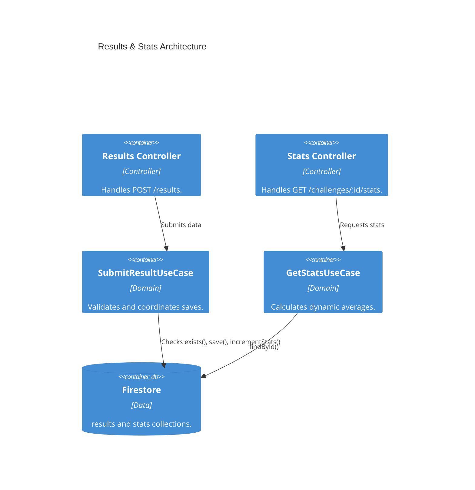

# Implementation Plan: Results & Global Stats

**Branch**: `main` | **Date**: 2026-04-20 | **Spec**: [specs/00005-results-global-stats/spec.md](./spec.md)

## Summary

**Goal**: Enable result submission and real-time global statistics aggregation.  
**Approach**: Use Firestore deterministic IDs for deduplication and atomic increments for updating stats (`totalWins`, `sumClicks`, `sumTime`, and `distribution`).  
**Key Constraint**: The `userId` must be provided by the client. Path/clicks validation will be basic (bounds checking).

## Technical Context

**Language/Version**: TypeScript 6.0.3 / Node.js (ES2022)  
**Primary Dependencies**: Express, Firebase Admin (existing)  
**Storage**: Firestore (`results` and `stats` collections)  
**Target Platform**: Local / Docker

## Instructions Check

| Principle | Verdict | Notes |
|-----------|---------|-------|
| Clean Architecture | PASS | `SubmitResultUseCase` and `GetStatsUseCase` isolate logic from HTTP. |
| Strict Type Safety | PASS | API payloads will use explicit types. |
| Functional Core | PASS | Use cases perform validation before any DB interaction. |
| Test-Driven Development (TDD) | PASS | Verification includes testing the aggregation logic. |

## Architecture



## Architecture Decisions

| ID | Decision | Options Considered | Chosen | Rationale |
|----|----------|--------------------|--------|-----------|
| AD-013 | Stats Calculation | Real-time query vs Pre-calculated | Pre-calculated sums | Calculating averages from 10k results at runtime is slow. Incrementing sums and doing `sum / total` at read time is O(1). |
| AD-014 | Duplicate Handling | 409 Conflict vs 200 OK | 200 OK | For idempotency, returning 200 OK (with a flag) prevents client retry loops while protecting stats. |

## Data Model Summary

Entities used:
- `GameResult` (results collection)
- `DailyStats` (stats collection)
*(Already implemented in E003)*

## API Surface Summary

| Endpoint | Method | Body | Response | Description |
|----------|--------|------|----------|-------------|
| `/results` | POST | `{ challengeId, userId, clicks, timeSeconds, path }` | `{ success: boolean, alreadySubmitted?: boolean }` | Submits a result. |
| `/challenges/:id/stats` | GET | N/A | `DailyStats & { averageClicks, averageTime }` | Fetches aggregated stats. |

## Testing Strategy

| Tier | Tool | Scope | Mock Boundary |
|------|------|-------|---------------|
| Unit | Jest | `SubmitResultUseCase` | Repository interfaces |
| Unit | Jest | `GetStatsUseCase` | Repository interfaces |
| Integration | Supertest | `/results` & `/challenges/:id/stats` | Express router |

## Implementation Hints

- **[HINT-009]** Averages: `averageClicks` and `averageTime` should not be stored in Firestore. Calculate them in `GetStatsUseCase` as `sumClicks / totalWins`. Handle division by zero.
- **[HINT-010]** Idempotency: In `SubmitResultUseCase`, check `resultsRepository.exists()`. If true, return early without calling `incrementStats`.

## Requirement Coverage Map

| Req ID | Component(s) | File Path(s) | Notes |
|--------|--------------|--------------|-------|
| FR-001 | Result Controller | `src/features/results/controllers/result.controller.ts` | Expose POST. |
| FR-002 | Submit Use Case | `src/features/results/domain/submit-result.usecase.ts` | Bounds validation. |
| FR-003 | Submit Use Case | `src/features/results/domain/submit-result.usecase.ts` | Duplication check. |
| FR-004 | Submit Use Case | `src/features/results/domain/submit-result.usecase.ts` | Trigger atomic increment. |
| FR-005 | Stats Controller | `src/features/stats/controllers/stats.controller.ts` | Expose GET. |
| FR-006 | Get Stats Use Case| `src/features/stats/domain/get-stats.usecase.ts` | Dynamic calculation. |

## Project Structure

```text
src/
  ~ features/
    ~ results/
      ~ domain/
        ~ submit-result.usecase.ts     # Implement logic
      ~ controllers/
        ~ result.controller.ts         # Implement POST
    ~ stats/
      ~ domain/
        ~ get-stats.usecase.ts         # Implement calculation
      ~ controllers/
        ~ stats.controller.ts          # Implement GET
```
