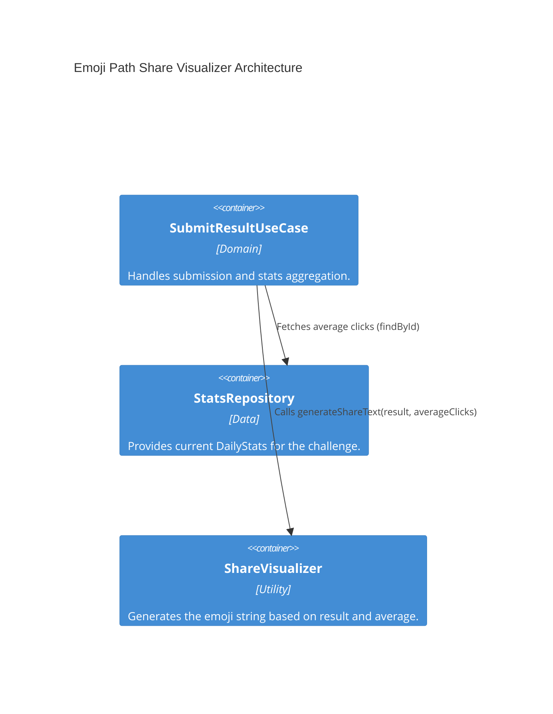

# Implementation Plan: Emoji Path Share Visualizer

**Branch**: `main` | **Date**: 2026-04-20 | **Spec**: [specs/00006-emoji-path-visualizer/spec.md](./spec.md)

## Summary

**Goal**: Transform a completed game path into a standardized, shareable text snippet containing emoji representations.  
**Approach**: Create a pure domain utility `ShareVisualizer` that compares the user's clicks against the daily average and formats an emoji grid. Integrate it into `SubmitResultUseCase` to return the `shareText`.  
**Key Constraint**: Paths longer than 25 clicks must be truncated to prevent massive text blocks.

## Technical Context

**Language/Version**: TypeScript 6.0.3 / Node.js (ES2022)  
**Primary Dependencies**: None (pure TS)  
**Target Platform**: Local / Docker

## Instructions Check

| Principle | Verdict | Notes |
|-----------|---------|-------|
| Clean Architecture | PASS | Visualizer is a pure utility, decoupled from any infrastructure or API. |
| Strict Type Safety | PASS | Uses defined interfaces for input/output. |
| Functional Core | PASS | Pure function for string generation based on inputs. |
| Test-Driven Development (TDD) | PASS | Format, truncation, and color-coding logic will be fully unit-tested. |

## Architecture



## Architecture Decisions

| ID | Decision | Options Considered | Chosen | Rationale |
|----|----------|--------------------|--------|-----------|
| AD-015 | Share Generation Timing | On Request vs On Submit | On Submit | Returning the `shareText` as part of the `POST /results` response minimizes API calls for the client. |

## Data Model Summary

No new database models required. Modifies the API response of `SubmitResultResponse`:
- Add `shareText?: string`

## API Surface Summary

Modifies `POST /results` response payload:
```json
{
  "success": true,
  "shareText": "WikiGame 2024-06-01 - 5 clicks ⏱️ 1:20\n🔵 🟩 🟩 🟩 🔵"
}
```

## Testing Strategy

| Tier | Tool | Scope | Mock Boundary |
|------|------|-------|---------------|
| Unit | Jest | `ShareVisualizer` logic | None (Pure functions) |
| Unit | Jest | `SubmitResultUseCase` | Repository interfaces |

## Implementation Hints

- **[HINT-011]** Time Formatting: Implement a helper to convert `timeSeconds` into a `M:SS` format for the header.
- **[HINT-012]** Emoji Scale: Start/End = 🔵. Efficient = 🟩 (<= avg). Average = 🟨 (> avg && <= avg * 1.5). Inefficient = 🟥 (> avg * 1.5).
- **[HINT-013]** Truncation: If clicks > 25, take the first 12, append `...`, and then the last 12.

## Requirement Coverage Map

| Req ID | Component(s) | File Path(s) | Notes |
|--------|--------------|--------------|-------|
| FR-001 | Submit Use Case | `src/features/results/domain/submit-result.usecase.ts` | Add to response. |
| FR-002 | ShareVisualizer | `src/features/results/utils/share-visualizer.ts` | Header format. |
| FR-003 | ShareVisualizer | `src/features/results/utils/share-visualizer.ts` | Emoji grid. |
| FR-004 | ShareVisualizer | `src/features/results/utils/share-visualizer.ts` | Performance comparison. |
| FR-005 | ShareVisualizer | `src/features/results/utils/share-visualizer.ts` | Truncation logic (> 25). |
| TR-001 | ShareVisualizer | `src/features/results/utils/share-visualizer.ts` | Pure domain utility. |
| TR-002 | Submit Use Case | `src/features/results/domain/submit-result.usecase.ts` | Integration. |

## Project Structure

```text
src/
  ~ features/
    ~ results/
      ~ domain/
        ~ submit-result.usecase.ts     # Integrate ShareVisualizer
      + utils/
        + share-visualizer.ts          # New pure utility logic
```
