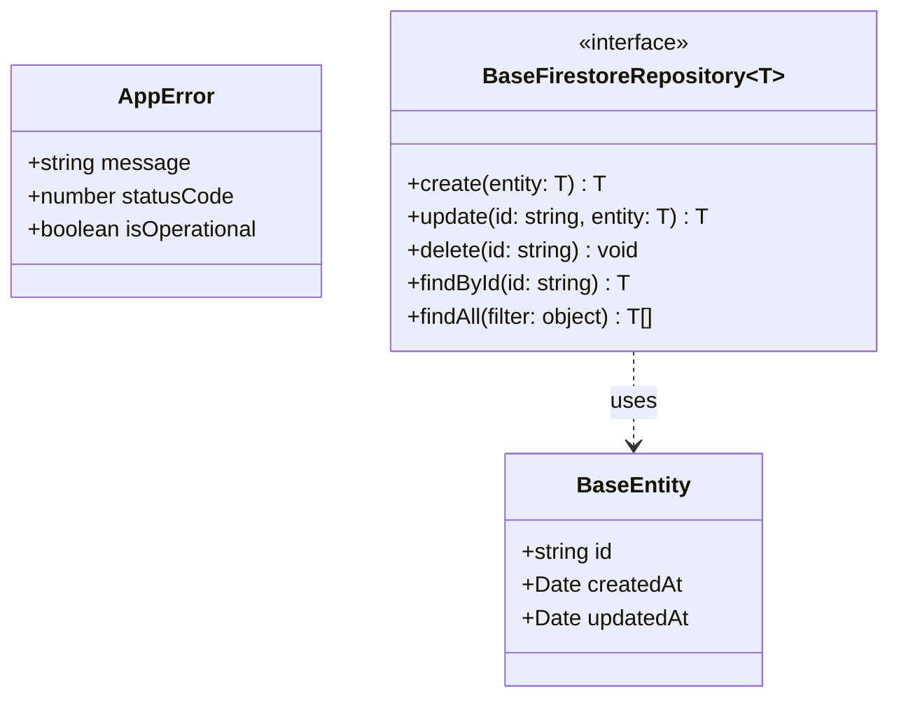

# Data Model: wikigame-backend Base Entities

This document defines the shared domain entities and base repository interfaces for the WikiGames platform.

## Shared Domain Entities

| Entity | Attributes (name: type, constraints) | Relationships | State Transitions |
|--------|--------------------------------------|---------------|-------------------|
| AppError | message: string, statusCode: number, isOperational: boolean, stack?: string | N/A | — |
| BaseEntity | id: string PK, createdAt: Date, updatedAt: Date | N/A | — |

## Base Repository Interface

The `BaseFirestoreRepository<T extends BaseEntity>` defines the standard contract for all feature repositories:

- `create(entity: Omit<T, 'id' | 'createdAt' | 'updatedAt'>): Promise<T>`
- `update(id: string, entity: Partial<T>): Promise<T>`
- `delete(id: string): Promise<void>`
- `findById(id: string): Promise<T | null>`
- `findAll(filter?: object): Promise<T[]>`

## Implementation Notes

- **AppError**: Used throughout the application to wrap operational errors with HTTP-aware metadata.
- **BaseEntity**: Every entity in the platform MUST extend this interface to ensure consistent metadata across Firestore collections.

Class Diagram (visual reference)

