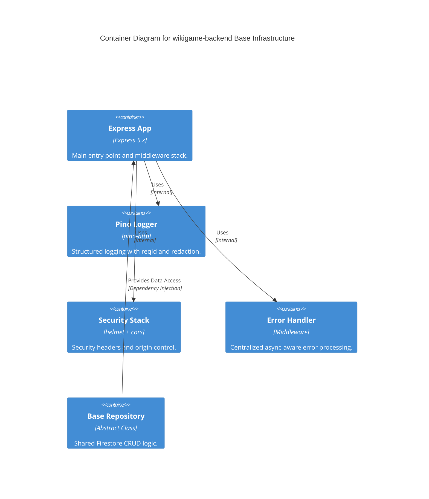

# Implementation Plan: Base Feature-Sliced Backend

**Branch**: `main` | **Date**: 2026-04-20 | **Spec**: [specs/00001-base-feature-sliced-backend-setup-shared/spec.md](./spec.md)

## Summary

**Goal**: Establish the base technical infrastructure and architectural layers to support modular, feature-sliced development.  
**Approach**: Refactor server entry point for Express 5.x, configure production-ready security/logging middleware, and implement base domain/data abstractions.  
**Key Constraint**: Express 5.x native async error handling MUST be the primary pattern for all routes and middleware.

## Technical Context

**Language/Version**: TypeScript 6.0.3 / Node.js (ES2022)  
**Primary Dependencies**: Express 5.2.1, helmet, cors, pino, pino-http, firebase-admin  
**Storage**: Firebase/Firestore (firebase-admin)  
**Testing**: Jest (`ts-jest`)  
**Target Platform**: Local development / Docker  
**Project Type**: web  
**Project Mode**: brownfield  
**Performance Goals**: Article proxying target < 200ms (with cache).  
**Constraints**: < 200ms p95 latency for infra middleware; raw JSON logging in production.  
**Scale/Scope**: Foundation for 4 core features (Articles, Challenges, Results, Stats).

## Instructions Check

*GATE: Must pass before Phase 0 research. Re-check after Phase 1 design.*

| Principle | Verdict | Notes |
|-----------|---------|-------|
| Clean Architecture | PASS | Plan enforces feature-sliced layers and decoupled base repository. |
| Strict Type Safety | PASS | Use of `any` is prohibited; interfaces define all data shapes. |
| Functional Core, Imperative Shell | PASS | Side effects isolated at boundaries (Pino, Firestore). |
| Test-Driven Development (TDD) | PASS | SC-003 requires domain logic to be testable in isolation. |

## Architecture



## Architecture Decisions

| ID | Decision | Options Considered | Chosen | Rationale |
|----|----------|--------------------|--------|-----------|
| AD-001 | Express 5.x Native Async | Manual try/catch / `express-async-handler` | Native | Express 5.x catches rejected promises automatically, reducing boilerplate. |
| AD-002 | Pino-HTTP for Logging | `winston` / `morgan` | `pino-http` | Best performance and native support for structured JSON and correlation IDs. |
| AD-003 | Base Repository Pattern | Generic Class / Direct Firestore | Generic Class | Centralizes common logic (metadata, error mapping) and ensures type safety. |

## Data Model Summary

| Entity | Key Fields | Relationships | Notes |
|--------|------------|---------------|-------|
| BaseEntity | id, createdAt, updatedAt | N/A | Base interface for all Firestore models. |
| AppError | message, statusCode, isOperational | N/A | Standard wrapper for all operational errors. |

**Detail**: `specs/00001-base-feature-sliced-backend-setup-shared/data-model.md`

## API Surface Summary

N/A — no new feature-level API surface. Infrastructure refactor only.

## Testing Strategy

| Tier | Tool | Scope | Mock Boundary | Install |
|------|------|-------|---------------|---------|
| Unit | Jest | `AppError`, `BaseRepository` logic | Firestore (Mock) | `configured` |
| Integration | Supertest | Middleware stack, security headers | Wikipedia API | `configured` |
| Security | `npm audit` | Dependency vulnerabilities | — | `npm audit` |
| Coverage | Jest | Line/branch coverage (90% target) | — | `npm test -- --coverage` |

## Error Handling Strategy

| Error Category | Pattern | Response | Retry |
|----------------|---------|----------|-------|
| Operational (AppError) | Catch & Format | Structured JSON with status code | No (fix client req) |
| System (Unknown) | Catch & Log | 500 Internal Server Error | No |
| Async Rejections | Native Auto-catch | Passed to Global Handler | N/A |

## Integration Points

| Spec Reference | System/Service | Technical Approach | Contract |
|----------------|----------------|--------------------|----------|
| TR-003 | Firebase Admin | `firebase-admin` SDK | Internal Repo Interface |

## Risk Mitigation

| Risk (from spec) | Likelihood | Impact | Mitigation | Owner |
|-------------------|------------|--------|------------|-------|
| Complexity of base classes | L | M | Keep `BaseRepository` lean; focus on common CRUD. | Core Team |
| Async error swallowing | L | H | Verify native Express 5 behavior with test cases. | Core Team |

## Requirement Coverage Map

| Req ID | Component(s) | File Path(s) | Notes |
|--------|--------------|--------------|-------|
| TR-001 | Logger Service | `src/shared/services/logger.service.ts` | Integrate `pino-http` with `genReqId`. |
| TR-002 | Logger Config | `src/shared/services/logger.service.ts` | Configure `redact` for auth/passwords. |
| TR-003 | Base Repository | `src/shared/data/base-firestore.repository.ts` | Shared persistence logic with `BaseEntity`. |
| TR-004 | Error Class | `src/shared/domain/app-error.ts` | Custom class extending `Error`. |
| TR-005 | Security Config | `src/index.ts` | Configure `cors` with env list. |
| OR-001 | Logger Transport | `src/shared/services/logger.service.ts` | Conditional `pino-pretty` for non-prod. |
| OR-002 | Logger Transport | `src/shared/services/logger.service.ts` | Default JSON for prod. |

## Project Structure

### Source Code

```text
src/
  ~ index.ts                           # Refactor: Express 5, security stack
  ~ middleware/
    ~ error-handler.middleware.ts      # Refactor: Standardized 4-arg async handler
  ~ shared/
    ~ data/
      + base-firestore.repository.ts   # New: Generic Firestore base
    ~ domain/
      + app-error.ts                   # New: Centralized error class
      + base.entity.ts                 # New: Base entity interface
    ~ services/
      ~ logger.service.ts              # Refactor: pino-http integration
  ~ features/                          # Layout: Ensure modular structure
    ~ [feature]/
      + domain/
      + data/
      + controllers/
```

**Patterns to reuse**: Existing `src/features` modularity.  
**Tests to extend**: `tests/health.test.ts` (verify security headers).  
**Naming conventions**: Kebab-case files, PascalCase classes/interfaces.

## Implementation Hints

- **[HINT-001]** Express 5: Ensure `app.use(errorHandler)` is the **last** middleware added to the stack.
- **[HINT-002]** Logging: Use `req.log` instead of the global `logger` inside route handlers to preserve correlation context.
- **[HINT-003]** Firestore: `BaseFirestoreRepository` should use the `db` instance from `@config/firebase.config`.
