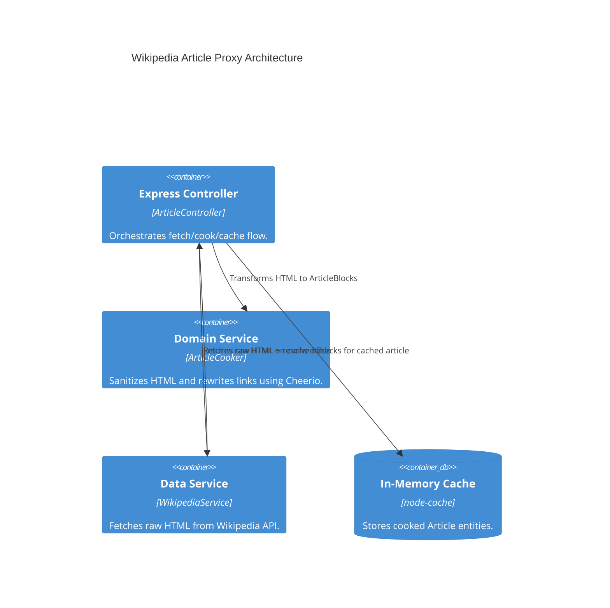

# Implementation Plan: Wikipedia Article Proxy

**Branch**: `main` | **Date**: 2026-04-20 | **Spec**: [specs/00002-wikipedia-article-proxy/spec.md](./spec.md)

## Summary

**Goal**: Provide a clean, game-ready version of Wikipedia articles by proxying and "cooking" the HTML content.  
**Approach**: Fetch raw HTML via Wikipedia's `action=parse` API, sanitize it using `cheerio` to extract text blocks and internal links, and cache results for performance.  
**Key Constraint**: Zero external links must remain in the cooked content; only internal Wikipedia article links are allowed.

## Technical Context

**Language/Version**: TypeScript 6.0.3 / Node.js (ES2022)  
**Primary Dependencies**: Express 5.2.1, cheerio, node-cache, axios  
**Integration Points**: Wikipedia Action API (`https://{lang}.wikipedia.org/w/api.php`)  
**Storage**: In-memory `node-cache`  
**Target Platform**: Docker / Local

## Instructions Check

| Principle | Verdict | Notes |
|-----------|---------|-------|
| Clean Architecture | PASS | Domain service `ArticleCooker` is pure; `WikipediaService` abstracts external API. |
| Strict Type Safety | PASS | Uses defined `Article`, `ArticleBlock`, and `ArticleSpan` interfaces. |
| Functional Core, Imperative Shell | PASS | Cooking logic is isolated from I/O; cache/API logic in data/shell. |
| Test-Driven Development (TDD) | PASS | `ArticleCooker` will be tested with static HTML fixtures. |

## Architecture



## Architecture Decisions

| ID | Decision | Options Considered | Chosen | Rationale |
|----|----------|--------------------|--------|-----------|
| AD-004 | Wikipedia API Action | `action=query` / `action=parse` | `action=parse` | Provides rendered HTML which is easier to sanitize for a "reading" experience. |
| AD-005 | Link Sanitization | Regex / Cheerio | `cheerio` | More robust for handling nested tags and attributes compared to regex. |
| AD-006 | Cache Key Format | `:lang::title` | `:lang::title` | Simple and enough for multi-language support. |

## Data Model Summary

Entities used from `src/features/articles/domain/article.entity.ts`:
- **Article**: Root containing `blocks`.
- **ArticleBlock**: Type-safe blocks (paragraph, header).
- **ArticleSpan**: Segments within paragraphs, mapping `<a>` tags to `link` property.

## API Surface Summary

| Endpoint | Method | Params | Response | Description |
|----------|--------|--------|----------|-------------|
| `/articles/:lang/:title` | GET | lang (en/es), title | `Article` | Returns sanitized JSON blocks. |

## Testing Strategy

| Tier | Tool | Scope | Mock Boundary |
|------|------|-------|---------------|
| Unit | Jest | `ArticleCooker` | None (Pure function) |
| Unit | Jest | `WikipediaService` | Wikipedia API (Nock) |
| Integration | Supertest | `GET /articles` | Wikipedia API (Nock) |
| Performance | Clinic.js | Proxy latency | — |

## Implementation Hints

- **[HINT-001]** Redirects: Always use the `redirects=1` flag in Wikipedia API and check the `redirects` array in the response to populate `resolvedTitle`.
- **[HINT-002]** Selectors: Focus on `h1`, `h2`, `h3`, and `#mw-content-text p` to avoid infoboxes and metadata.
- **[HINT-003]** Span Parsing: When parsing `<p>`, split text by `<a>` tags to create an array of `ArticleSpan`.

## Requirement Coverage Map

| Req ID | Component(s) | File Path(s) | Notes |
|--------|--------------|--------------|-------|
| FR-001 | WikipediaService | `src/features/articles/data/wikipedia.service.ts` | Integration with `action=parse`. |
| FR-002 | WikipediaService | `src/features/articles/data/wikipedia.service.ts` | Resolve redirects. |
| FR-003 | ArticleCooker | `src/features/articles/utils/html-cooker.ts` | Strip non-wiki links. |
| FR-004 | ArticleCooker | `src/features/articles/utils/html-cooker.ts` | Rewrite links to proxy titles. |
| FR-005 | ArticleCooker | `src/features/articles/utils/html-cooker.ts` | Strip UI clutter (infoboxes, tables). |
| TR-001 | ArticleCooker | `src/features/articles/utils/html-cooker.ts` | Use `cheerio`. |
| TR-002 | ArticleCooker | `src/features/articles/utils/html-cooker.ts` | Domain layer isolation. |
| TR-003 | ArticleController | `src/features/articles/controllers/article.controller.ts` | `node-cache` integration. |
| TR-004 | ArticleRoutes | `src/features/articles/article.routes.ts` | Endpoint definition. |

## Project Structure

```text
src/
  ~ features/
    ~ articles/
      ~ controllers/
        + article.controller.ts        # Orchestration + Cache
      ~ data/
        + wikipedia.service.ts         # API Client
      ~ domain/
        ~ article.entity.ts            # Existing interfaces
        + get-article.usecase.ts       # Domain use case
      ~ utils/
        + html-cooker.ts               # Cheerio sanitization logic
      + article.routes.ts              # Route registration
```
