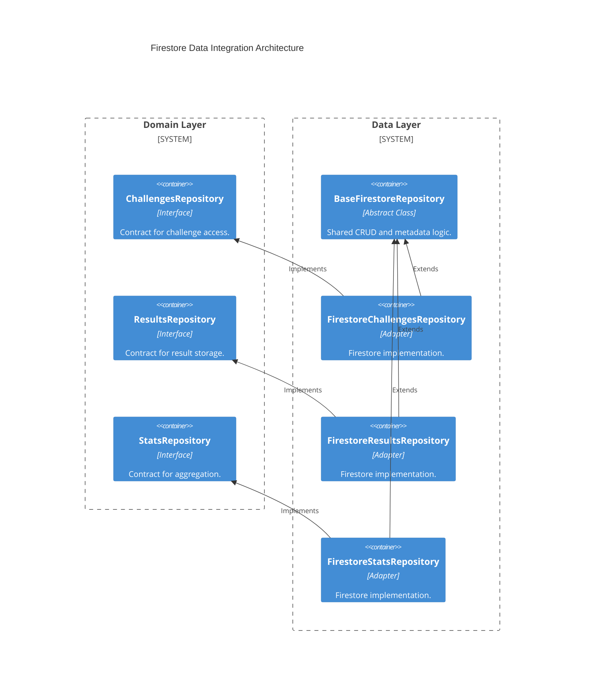

# Implementation Plan: Firestore Data Integration

**Branch**: `main` | **Date**: 2026-04-20 | **Spec**: [specs/00003-firestore-data-integration/spec.md](./spec.md)

## Summary

**Goal**: Establish a unified, type-safe persistence layer for challenges, results, and statistics.  
**Approach**: Refactor existing repositories to extend `BaseFirestoreRepository`, implement domain-driven repository interfaces, and use Firestore atomic operations for aggregation.  
**Key Constraint**: Zero Firestore-specific types (like `FieldValue`) should leak into the use cases; they must be encapsulated within the repository adapters.

## Technical Context

**Language/Version**: TypeScript 6.0.3 / Node.js (ES2022)  
**Primary Dependencies**: firebase-admin  
**Storage**: Firestore  
**Target Platform**: Cloud (Firebase) / Local Emulator

## Instructions Check

| Principle | Verdict | Notes |
|-----------|---------|-------|
| Clean Architecture | PASS | Repositories implement domain interfaces; infrastructure isolated in `data/`. |
| Strict Type Safety | PASS | Uses generic `BaseFirestoreRepository<T>` and explicit entity types. |
| Functional Core, Imperative Shell | PASS | Persistence side effects contained within adapter boundary. |
| Test-Driven Development (TDD) | PASS | Verification includes unit tests with Firestore mocks. |

## Architecture



## Architecture Decisions

| ID | Decision | Options Considered | Chosen | Rationale |
|----|----------|--------------------|--------|-----------|
| AD-007 | Repository Inheritance | Direct usage / Inheritance | Inheritance | `BaseFirestoreRepository` provides standardized metadata (timestamps) and ID mapping. |
| AD-008 | Atomic Aggregation | Transactions / Increments | increments | `FieldValue.increment` is faster and more scalable than transactions for simple counters. |
| AD-009 | Result ID Strategy | Auto-ID / Deterministic | Deterministic | `${challengeId}_${userId}` prevents double-voting/duplicate results without extra queries. |

## Data Model Summary

Entities are already defined in `domain/` directories. This epic ensures they are correctly mapped to Firestore collections.

| Entity | Collection | ID Strategy | Notes |
|--------|------------|-------------|-------|
| Challenge | `challenges` | `YYYY-MM-DD` | One challenge per day. |
| GameResult | `results` | `${challengeId}_${userId}` | Unique per user per challenge. |
| DailyStats | `stats` | `challengeId` | Aggregated per day. |

## API Surface Summary

N/A (Data layer only).

## Testing Strategy

| Tier | Tool | Scope | Mock Boundary |
|------|------|-------|---------------|
| Unit | Jest | `Firestore*Repository` | Firestore (using `jest-mock`) |
| Integration | Jest | End-to-end CRUD | Firestore Emulator (optional for MVP) |

## Implementation Hints

- **[HINT-004]** Metadata: Ensure `mapDoc` in `BaseFirestoreRepository` handles Firestore `Timestamp` objects correctly by converting them to JS `Date`.
- **[HINT-005]** Stats Bucketing: Group click counts > 20 into a single '20plus' bucket in the distribution map.

## Requirement Coverage Map

| Req ID | Component(s) | File Path(s) | Notes |
|--------|--------------|--------------|-------|
| TR-001 | Repositories | `src/features/*/data/*repository.ts` | Map internal types to domain entities. |
| TR-002 | Metadata | `src/shared/data/base-firestore.repository.ts` | Already implemented, verify usage. |
| TR-003 | Aggregator | `src/features/stats/data/firestore-stats.repository.ts` | Implement `incrementStats`. |
| TR-004 | Interfaces | `src/features/*/domain/*repository.ts` | Ensure all interfaces are present. |
| QR-001 | Tests | `tests/unit/features/*/repository.test.ts` | Unit tests for each feature repo. |

## Project Structure

```text
src/
  ~ features/
    ~ challenges/
      ~ domain/
        ~ challenges.repository.ts     # Update interface
      ~ data/
        ~ firestore-challenges.repository.ts # Refactor
    ~ results/
      ~ domain/
        + results.repository.ts        # Ensure interface exists
      ~ data/
        ~ firestore-results.repository.ts # Refactor
    ~ stats/
      ~ domain/
        ~ stats.repository.ts          # Update interface
      ~ data/
        ~ firestore-stats.repository.ts   # Refactor
```
