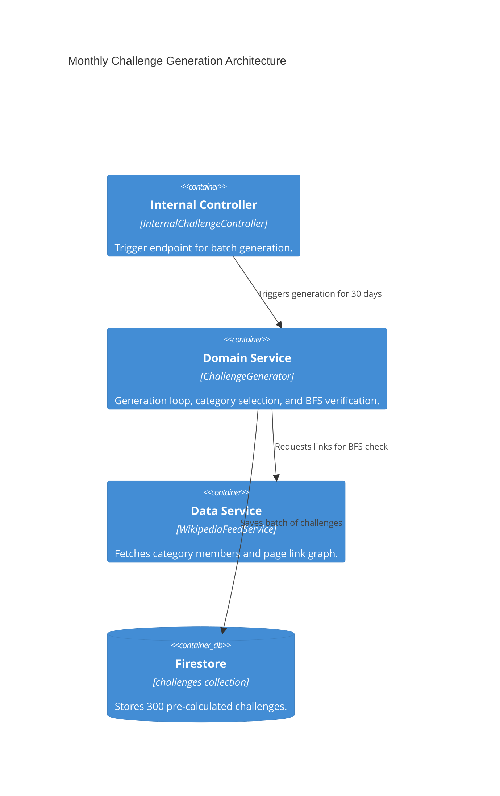

# Implementation Plan: Monthly Challenge Generation

**Branch**: `main` | **Date**: 2026-04-20 | **Spec**: [specs/00004-monthly-challenge-generation/spec.md](./spec.md)

## Summary

**Goal**: Automate the generation of 30 days of playable content (300 challenges) organized by daily categories.  
**Approach**: Define a pool of 30 curated categories, select 10 reachable article pairs (BFS depth ≤ 6) per category/day, and persist to Firestore with deterministic IDs.  
**Key Constraint**: All 10 challenges for a specific day must belong to the same category. Reachability must be verified via Wikipedia link-graph analysis.

## Technical Context

**Language/Version**: TypeScript 6.0.3 / Node.js (ES2022)  
**Primary Dependencies**: axios, firebase-admin  
**Integration Points**: Wikipedia Action API (`list=categorymembers`, `prop=links`)  
**Target Platform**: Internal Admin Endpoint / Scheduled Cron

## Instructions Check

| Principle | Verdict | Notes |
|-----------|---------|-------|
| Clean Architecture | PASS | `ChallengeGenerator` (domain) decoupled from `WikipediaFeedService` (data). |
| Strict Type Safety | PASS | Updated `Challenge` interface with mandatory `category` field. |
| Functional Core | PASS | BFS and selection logic are pure domain logic. |
| Test-Driven Development (TDD) | PASS | BFS logic will be unit tested with mock link graphs. |

## Architecture



## Architecture Decisions

| ID | Decision | Options Considered | Chosen | Rationale |
|----|----------|--------------------|--------|-----------|
| AD-010 | Verification Algorithm | Random Guess / BFS / DFS | BFS | Breadth-First Search ensures the *shortest* path is within 6 clicks. |
| AD-011 | ID Format | `YYYY-MM-DD_N` | `YYYY-MM-DD_N` | Allows 10 slots per day while keeping date-based lookup efficient. |
| AD-012 | Category Source | Dynamic / Static Pool | Static Pool | A curated pool of 30 broad categories ensures high-quality article pairs. |

## Data Model Summary

Updated `Challenge` entity in `src/features/challenges/domain/challenge.entity.ts`:
- `id`: string (format: `YYYY-MM-DD_N`)
- `category`: string (e.g., "Science")
- `startTitle`: string
- `endTitle`: string
- `lang`: string
- `createdAt`: Date
- `updatedAt`: Date

## API Surface Summary

| Endpoint | Method | Body | Auth | Description |
|----------|--------|------|------|-------------|
| `/internal/challenges/generate` | POST | `{ startDate?: string }` | API Key | Generates 300 challenges for 30 days starting from `startDate`. |

## Testing Strategy

| Tier | Tool | Scope | Mock Boundary |
|------|------|-------|---------------|
| Unit | Jest | `ChallengeGenerator` | Wikipedia API (Mocked links) |
| Unit | Jest | `WikipediaFeedService` | Wikipedia API (Nock) |
| Integration | Supertest | `/internal/challenges/generate` | Firestore Emulator |

## Implementation Hints

- **[HINT-006]** BFS Optimization: To avoid infinite loops and massive memory usage, limit the breadth (max 50 links per level) and depth (max 6).
- **[HINT-007]** Category Member Fetch: Use `cmtype=page` to exclude subcategories and files from the selection pool.
- **[HINT-008]** Batch Writes: Firestore `writeBatch` can handle up to 500 operations. Use one batch per generation run (300 items).

## Requirement Coverage Map

| Req ID | Component(s) | File Path(s) | Notes |
|--------|--------------|--------------|-------|
| FR-001 | Category Pool | `src/features/challenges/domain/categories.ts` | List of 30 broad categories. |
| FR-002 | Feed Service | `src/features/challenges/data/wikipedia-feed.service.ts` | Fetch members and links. |
| FR-003 | Generator Loop | `src/features/challenges/domain/generate-challenge.usecase.ts` | 30-day * 10-index loop. |
| FR-004 | BFS Logic | `src/features/challenges/domain/generate-challenge.usecase.ts` | Solvability check. |
| FR-005 | Storage | `src/features/challenges/data/firestore-challenges.repository.ts` | Save with custom ID. |
| TR-003 | Entity | `src/features/challenges/domain/challenge.entity.ts` | Add category field. |

## Project Structure

```text
src/
  ~ features/
    ~ challenges/
      ~ domain/
        ~ challenge.entity.ts          # Update interface
        + categories.ts                # Static pool
        + generate-challenge.usecase.ts # Generation logic + BFS
      ~ data/
        + wikipedia-feed.service.ts     # Category/Link API
      ~ controllers/
        + internal-challenge.controller.ts # Trigger endpoint
```
