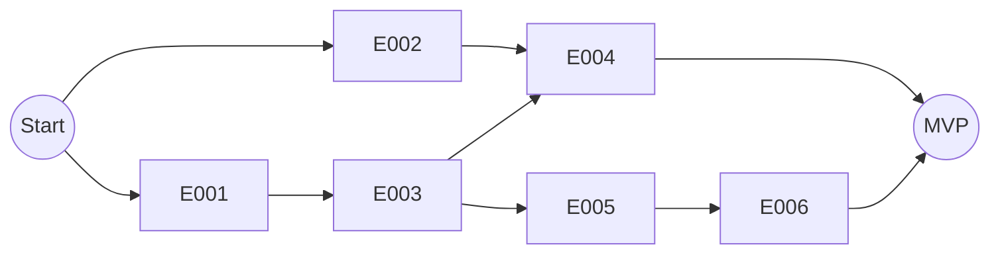

# Project Implementation Plan

> Product: wikigame-backend | Status: Draft
> Total Epics: 6 | P1: 5 | P2: 1 | P3: 0
> Waves: 3

## Epic Checklist

### Wave 1 — Foundation & Core Logic
> Establishes the architectural backbone and the "Article Cooking" engine.

- [X] E001 [P1] [TECHNICAL] [P] {SAD:ADR-0001} Base Feature-Sliced Backend — setup shared infra and layers
- [X] E002 [P1] [PRODUCT] [P] {PRD:CAP-002} Wikipedia Article Proxy — implement "Article Cooking" and sanitization logic

### Wave 2 — Game Loop & Storage
> Implements the persistence layer and the primary game cycle.

- [X] E003 [P1] [TECHNICAL] [P] {SAD:ADR-0001} Firestore Data Integration — implement repository adapters and base models
- [X] E004 [P1] [PRODUCT] {PRD:CAP-001,SAD:ADR-0002} Monthly Challenge Generation — implement batch generation and reachability loop

### Wave 3 — Social & Analytics
> Finalizes the MVP with results tracking and shareability features.

- [ ] E005 [P1] [PRODUCT] [P] {PRD:CAP-003} Results & Global Stats — implement submission and daily aggregation
- [ ] E006 [P2] [PRODUCT] [P] {PRD:CAP-004} Emoji Path Share Visualizer — implement result-to-emoji transformation logic

## Dependency Diagram

## Execution Wave Summary

| Wave | Epics | All Parallel? | Notes |
|------|-------|---------------|-------|
| 1 | E001, E002 | Yes | Foundational setup and stateless proxy logic. |
| 2 | E003, E004 | Partially | E004 depends on E003 repository adapters. |
| 3 | E005, E006 | Yes | Stats aggregation and social sharing features. |

## Epic Details

### E001: Base Feature-Sliced Backend
- **Category**: TECHNICAL | **Priority**: P1
- **Source**: {SAD:ADR-0001}
- **Scope**: Initialize the Express server with Helmet, CORS, and Pino. Implement the shared directory structure (`/src/shared`) and base classes for the feature-sliced architecture.
- **Key Entities**: Shared Interfaces, Error Handler
- **Acceptance Criteria**:
  - [X] Express server running with security middleware
  - [X] Folder structure follows SAD ADR-0001
  - [X] Global error handler and logger functional

### E002: Wikipedia Article Proxy
- **Category**: PRODUCT | **Priority**: P1
- **Source**: {PRD:CAP-002}
- **Scope**: Implement the "Article Cooking" domain service using Cheerio. Fetch raw HTML from Wikipedia, strip non-article links/images, and rewrite internal links for game use. Integrate `node-cache`.
- **Key Entities**: Article, ArticleBlock, ArticleCooker
- **Acceptance Criteria**:
  - [X] Wikipedia articles fetched and cached
  - [X] HTML sanitized (no external links, no UI clutter)
  - [X] Internal links rewritten to point back to the proxy endpoint

### E003: Firestore Data Integration
- **Category**: TECHNICAL | **Priority**: P1
- **Source**: {SAD:ADR-0001}
- **Scope**: Configure Firebase Admin SDK and implement base Firestore repository. Create specific repository adapters for Articles, Challenges, and Results.
- **Key Entities**: BaseRepository, FirestoreAdapters
- **Acceptance Criteria**:
  - [X] Firestore connection established
  - [X] Base CRUD operations functional for feature repositories
  - [X] Repository interfaces decoupled from Firestore implementation

### E004: Monthly Challenge Generation
- **Category**: PRODUCT | **Priority**: P1
- **Source**: {PRD:CAP-001,SAD:ADR-0002}
- **Scope**: Implement the monthly batch generator. Select random article pairs and run a reachability verification loop (BFS) to ensure paths are solvable. Save challenges with `YYYY-MM-DD` IDs.
- **Key Entities**: Challenge, ChallengeGenerator
- **Acceptance Criteria**:
  - [X] Endpoint for monthly generation functional
  - [X] Reachability loop validates paths (max 6 clicks)
  - [X] Challenges saved correctly for the upcoming month

### E005: Results & Global Stats
- **Category**: PRODUCT | **Priority**: P1
- **Source**: {PRD:CAP-003}
- **Scope**: Implement result submission logic (clicks, time, path). Create daily stats aggregation to calculate averages and distributions per challenge.
- **Key Entities**: Result, DailyStats
- **Acceptance Criteria**:
  - [ ] Users can submit valid game results
  - [ ] Global stats calculated and served for each challenge
  - [ ] Aggregation logic handles concurrent submissions

### E006: Emoji Path Share Visualizer
- **Category**: PRODUCT | **Priority**: P2
- **Source**: {PRD:CAP-004}
- **Scope**: Implement the logic to transform a completed click-path into a non-spoiler emoji grid (e.g., 🟩⬜⬜🟦). Ensure the output format is optimized for social media.
- **Key Entities**: ShareVisualizer
- **Acceptance Criteria**:
  - [ ] Result payload includes emoji grid string
  - [ ] Formatting follows Wordle-style viral patterns
  - [ ] Logic correctly identifies "safe" path representation

## Coverage Validation

### PRD Coverage
| Capability ID | Capability | Epic |
|---------------|------------|------|
| CAP-001 | Daily Challenge Management | E004 |
| CAP-002 | Wikipedia Article Proxy | E002 |
| CAP-003 | Results & Global Stats | E005 |
| CAP-004 | Share Visualizer | E006 |

### SAD Coverage
| ADR ID | Title | Epic |
|--------|-------|------|
| ADR-001 | Feature-Sliced Architecture | E001, E003 |
| ADR-002 | Monthly Challenge Batch Generation | E004 |

## Shared Artifact Surface

### Shared Data Entities
| Entity | Introduced By | Consumed By |
|--------|---------------|-------------|
| Article | E002 | E004 |
| Challenge | E004 | E005 |
| Result | E005 | E006 |

### API Surfaces
| Endpoint | Introduced By | Consumed By |
|----------|---------------|-------------|
| `GET /articles/:title` | E002 | Client |
| `POST /internal/challenges/generate` | E004 | Cron/Admin |
| `POST /results` | E005 | Client |

## Wave Transition Protocol
1. **Wave 1 → 2**: Verify E001/E002 passed QC. Shared `Article` entity stable.
2. **Wave 2 → 3**: Verify E003/E004 passed QC. Firestore repositories ready for `Result` storage.
