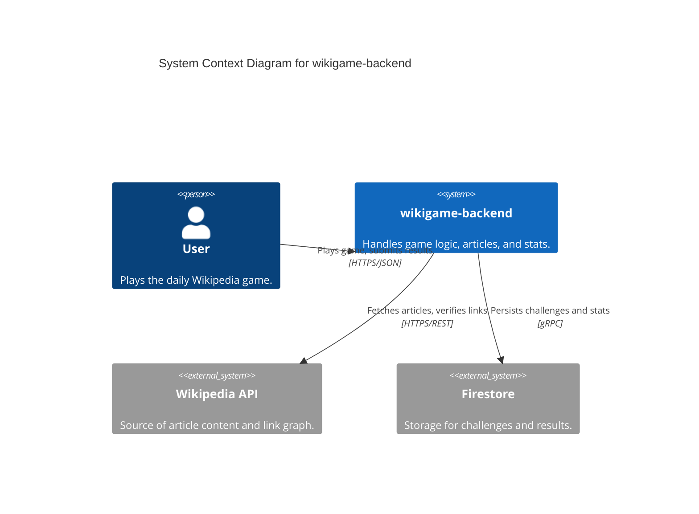
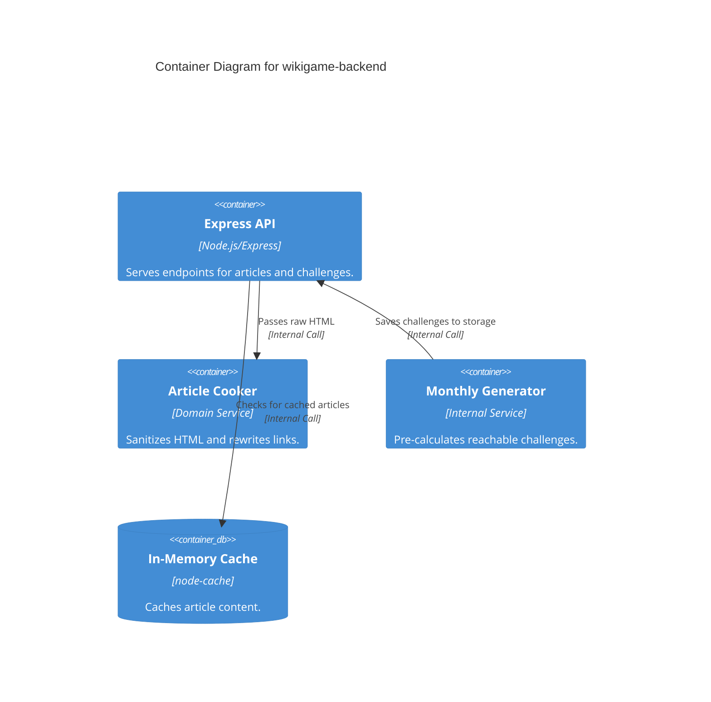

# Software Architecture Document: wikigame-backend

> Date: 2026-04-20 | Status: Draft

## Project Context & Scope

`wikigame-backend` provides the core API and game loop for a daily Wikipedia navigation challenge. It handles article proxying, challenge lifecycle, and global statistics.

## Solution Strategy

The system follows **Clean Architecture** and **Feature-Sliced Design**. It prioritizes a "Functional Core" for article cooking and path logic, while isolating "Imperative Shell" side effects (Firestore, Wikipedia API) in the data layer.

## Technology Context

- **Language/Runtime**: TypeScript 6.0.3 / Node.js (ES2022)
- **Frameworks**: Express 5.2.1
- **Storage**: Firebase/Firestore
- **Caching**: `node-cache` (In-memory)
- **Testing**: Jest (`ts-jest`)
- **Target Platform**: Docker / Local

## Architecture Decision Records

| ID | Title | Status | Link |
|----|-------|--------|------|
| 001 | Feature-Sliced Architecture | Accepted | [001-feature-sliced-architecture.md](./adrs/001-feature-sliced-architecture.md) |
| 002 | Monthly Challenge Batch Generation | Accepted | [002-monthly-challenge-generation.md](./adrs/002-monthly-challenge-generation.md) |

## System Context Diagram

## Container Diagram

## Cross-Cutting Concerns

- **Security**: `helmet` and `cors` middleware. No sensitive PII stored.
- **Reliability**: Pre-calculated challenges ensure 24/7 uptime even if generator fails.
- **Observability**: `pino` for structured logging.
- **Data Management**: Monthly cleanup of old results (optional).

## Quality Attributes

- **Performance**: Article proxying target < 200ms (with cache).
- **Scalability**: Stateless API containers.
- **Testability**: > 90% coverage for `domain` and `utils` layers.

## Open Questions

- Should the verification loop limit the "minimum" path length (e.g., at least 3 clicks)?
- How to handle large images in the proxy? (Current: strip them).

## Project Context Baseline Updates

- **Architecture Strategy**: Enforced Feature-Sliced Design (`domain/data/controllers`) within each feature slice.
- **Article Proxy**: Implemented `ArticleCooker` domain service using `cheerio` for HTML sanitization and link rewriting. Caching layer uses `node-cache` with 1-hour TTL.
- **Challenge Generation**: Automated batch generator creates 30 days of content (10 per day) using Wikipedia category members. BFS depth limit of 6 ensures solvability.
- **Data Access**: Unified `BaseFirestoreRepository<T>` pattern. Specific feature repositories (Challenges, Results, Stats) implement domain interfaces and use deterministic IDs and atomic increments.

- **Error Handling**: Standardized `AppError` class and 4-argument global error middleware leveraging Express 5.x native async support.

- **Observability**: Structured logging via `pino-http` with automatic `reqId` generation and correlation.
- **Data Access**: `BaseFirestoreRepository<T>` pattern for consistent CRUD operations and metadata management across all features.
- **Security Baseline**: `helmet` and `cors` (environment-specific) configured at the root middleware stack.

